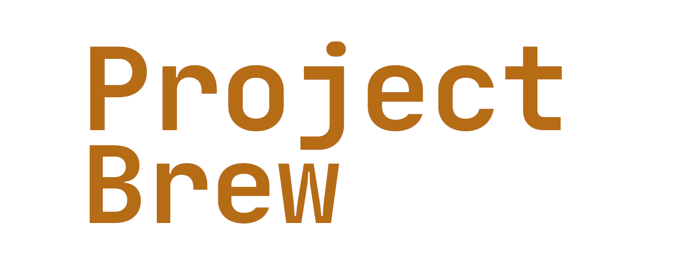

This is the front-end for [Project Brew](https://github.com/simonsben/Project-Brew).
It is simply meant to cleanly display the data collected by Project Brew.
  

## Objectives

- [X] Rebuild site using React and better code
- [X] Statically host the site on S3
- [X] Remove the need to relead the page during navigation
- [X] Fix default files and information setup by CreateReactApp
- [X] Add individual beer pages
- [ ] Add a *smart* search page
- [ ] Add graphs
- [ ] Add option to subtract the deposit amount
